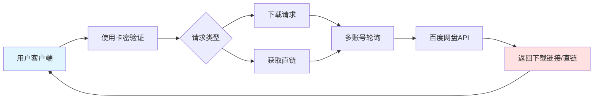

# PandownloadServer - 专业百度网盘高速下载服务系统

   

---

## 产品简介

**PandownloadServer** 是专业的Pandownload后台系统，支持多账号轮询、卡密创建、分发下载。**核心功能：** 多账号轮询（支持添加多个百度账号，自动轮询切换，避免单账号限流）、卡密创建（批量生成卡密，支持按次数、按流量、按时间计费）、分发下载（支持最新版Pandownload客户端，实现满速下载）
---

## 系统架构

---

## 技术支持与系统部署
**wx**：nbsl20
